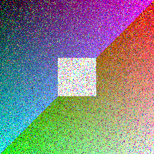
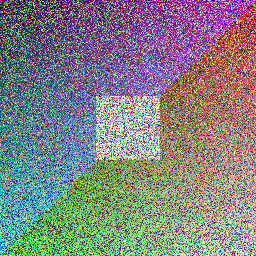
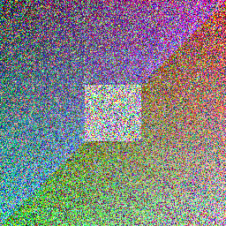
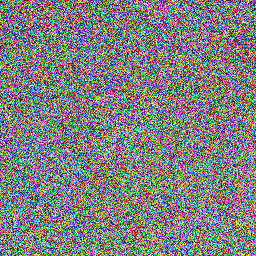

# decayfmt

A file format where decay is a first-class property. Every time you open a decayfmt
file it permanently corrupts a little, by an amount baked into the filename. There is
no recovery from the file alone. The file is the only copy that matters, and every read
destroys a little more of it.

Two file types:

- `.idcy<x>` for images (example: `photo.idcy3`)
- `.tdcy<x>` for text (example: `note.tdcy7`)

`x` is a positive integer in the filename, the instability parameter. Higher `x` means
more corruption per open.

## Watch it decay

The same image, encoded at two instability values, then opened. Each open corrupts it
further on disk, permanently, before it is ever shown. There is no way back.

The clean original:


| Instability | After 1 open | After 3 opens |
| :---: | :---: | :---: |
| `x=3` (gentle) |  |  |
| `x=10` (severe) |  |  |

At `x=3` the image degrades gracefully over many opens. At `x=10` it is nearly gone after
one open and pure noise after three. `x` is the dial between a slow fade and near-instant
destruction.

Text decays the same way. A sentence encoded at `x=1` (a slow burn), printed after a few
opens:

```text
original : It was the best of times, it was the worst of times.
 open 1  : It was the best og times,/it!was the worst of times.
 open 3  : It_was the best2op times,/ih!wRs the worst of times.
 open 6  : I)_was thefb1st2op ti,es,/ih!w+> 0he worsBVwflti0es.
 open 9  : I)+was thefb}st2op tive<,/ih!w+>;0bemAorsBVw-It`0es.
 open 12 : I)+was ~hefb}sQlop tiv\b"/ih!w+>;0be9AVrsBVK-8d`0es.
```

Corruption only ever swaps in printable characters, so text garbles into readable-looking
nonsense rather than binary noise.

## What this is, and is not

decayfmt is a social contract enforced by math, not cryptography. It is not encryption,
not DRM, and not a secure deletion tool. The corruption is honest and unrecoverable from
the file alone, but anyone with a backup or a hex editor can defeat it. If you want the
original, keep a backup. If you do not want anyone to recover it, do not make one.

## Install

### From a release

Download the binary for your platform from the
[releases page](https://github.com/aravpanwar/decayfmt/releases) and put it on your PATH.
There is no runtime dependency to install.

### From source

Requires a Rust toolchain.

```
cargo build --release
```

The binary is produced at `target/release/decayfmt`.

## Usage

### Encode

Turn a source image or text file into a decayfmt file. Encoding never corrupts; the new
file is clean.

```
decayfmt encode --input photo.png --x 3 --output photo.idcy3
decayfmt encode --input note.txt  --x 7 --output note.tdcy7
```

The file type comes from the output extension: `idcy` for images, `tdcy` for text.
Images are decoded to raw RGBA; text must be valid UTF-8.

### Open

Open a decayfmt file. This corrupts it in place on disk, then displays the result.
Images open in your system's default image viewer. Text prints to the terminal, and
when there is no terminal (for example when launched from a file manager) it also
opens in your default text editor.

```
decayfmt open photo.idcy3
decayfmt open note.tdcy7
```

`x` is read from the filename, so renaming the file changes how hard the next open hits.

## How the corruption works

On each open, a per-byte corruption probability is derived from `x`:

```
p = 1 - exp(-x / 10)
```

So `x = 1` corrupts roughly 9.5% of eligible bytes per open, `x = 5` roughly 39%, and
`x = 10` roughly 63%. The randomness comes from the operating system CSPRNG and is never
seeded, so two opens of the same state look different.

- **Images:** the red, green, and blue channels are each corrupted independently with
  probability `p`. The alpha channel is never touched, so corruption shows as color
  noise rather than transparency holes.
- **Text:** each byte is replaced, with probability `p`, by a random printable ASCII
  byte. This operates on bytes, not characters, so at high `x` it can break UTF-8; the
  viewer renders what it can and substitutes the replacement character for the rest.

## The contract

- Corruption is written to disk at open time, before display. A crash or kill after the
  write does not undo it. Opening always costs a corruption.
- A read-only file is refused with an error and never displayed. A free read would break
  the contract.
- The header is never changed after encoding. Only the payload decays.
- There is no state in the file: no read counter, no timestamp, no record of who opened
  it or when.
- There is no recovery mechanism of any kind.

## Limitations

- This is a social contract, not cryptography. A backup defeats it entirely.
- A determined person with a hex editor can tamper with the file.
- It is not a secure deletion tool and makes no cryptographic guarantee.
- v1 supports images and text only. No audio, video, or other binary formats.

## License

See [LICENSE](LICENSE).
